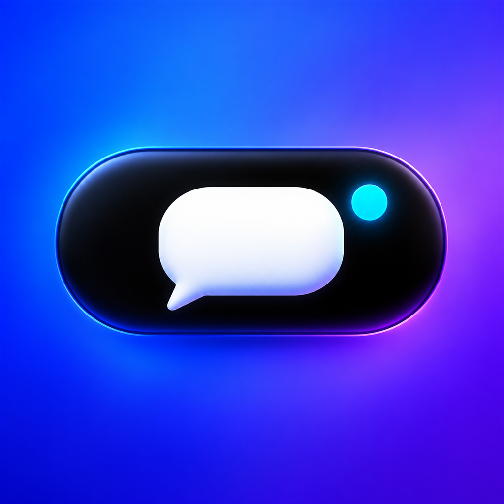
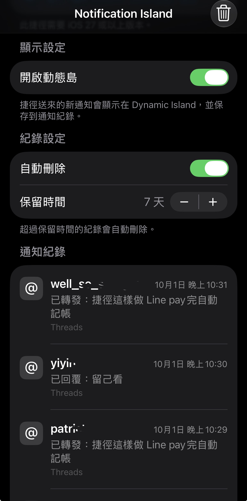

# NotificationIsland

<p align="center">
  
</p>

> Display custom notifications on the iPhone Dynamic Island from Shortcuts, while keeping a searchable history inside the app.

[繁體中文](./README.md) · [Download the latest IPA](https://github.com/panda-island/NotificationIsland/releases/latest) · [Add the Shortcut](https://www.icloud.com/shortcuts/c50df63435ea4f5f927447d1431173a1)

> [!IMPORTANT]
> NotificationIsland currently supports **iOS 27 or later** and is recommended for iPhones with Dynamic Island.

## 📲 Installation

### 1. Download the IPA

Open [GitHub Releases](https://github.com/panda-island/NotificationIsland/releases/latest) and download the latest `NotificationIsland-unsigned.ipa`.

### 2. Sign and install it

The release contains an **unsigned IPA**, so it cannot be installed like an App Store app. Sign it with your own Apple ID using one of the following legitimate sideloading tools:

- Sideloadly
- iLoader
- Another iOS-compatible IPA signing tool

Signing duration, App ID limits, and re-signing requirements for free Apple Developer accounts are controlled by Apple's developer system.

### 3. Add the Shortcut

After installing and opening the app:

1. Tap **Add Shortcut** inside NotificationIsland.
2. Add **Show Dynamic Island Message** from the iCloud Shortcut page.
3. Configure the title, message, and notification icon in the Shortcuts app.
4. Run the Shortcut to display the notification on Dynamic Island.

You can also open it directly: [Add the NotificationIsland Shortcut](https://www.icloud.com/shortcuts/c50df63435ea4f5f927447d1431173a1)

## 🎬 Preview

<p align="center">
  
</p>

▶️ [Watch the Dynamic Island demo video (MOV)](./docs/media/notification-island-demo.mov)

## ✨ App Features

- **Dynamic Island notifications:** Display a custom title, message, and app icon.
- **Automatic five-second dismissal:** The Live Activity is removed after approximately five seconds.
- **Immediate replacement:** A new notification removes the previous Dynamic Island and displays the latest content.
- **Display toggle:** Disable Dynamic Island while continuing to save notification history.
- **Notification history:** Save titles, messages, icons, and timestamps; delete individual records or clear everything.
- **Automatic cleanup:** Disable automatic deletion or retain records for 1–365 days; the default is seven days.
- **Multiple notification icons:** LINE, Instagram, Gmail, Messages, Retro, Pikmin Bloom, Duolingo, Investment Master, Taishin Bank, StressWatch, Reddit, and Threads.
- **Tap to open:** Tapping a Live Activity attempts to open the app represented by its selected icon.

## 📱 Requirements

- iOS 27 or later
- An iPhone with Dynamic Island is recommended
- An Apple ID and compatible signing tool when installing the unsigned IPA

## ⚠️ Limitations

NotificationIsland is an experimental project built with SwiftUI, ActivityKit, WidgetKit, App Intents, and Shortcuts. It is not an official notification tool from LINE, Instagram, Gmail, Apple, or any other third-party service.

The project cannot read private system notifications from other apps. Notification content must be supplied by the user through Shortcuts:

```text
Shortcuts → NotificationIsland → Live Activity → Dynamic Island
```

Whether tapping a Live Activity can open another app depends on that app's URL scheme, Universal Link support, and iOS restrictions.

## 🛠️ Building from Source

Open `NotificationIsland.xcodeproj` in Xcode to build the project. Windows users can also fork the repository and use the included GitHub Actions macOS runner to produce an unsigned IPA for signing and installation.

Core technologies: Swift, SwiftUI, ActivityKit, WidgetKit, App Intents, Shortcuts, and Live Activities.

## 💖 Sponsor

If you find this project useful, you are welcome to support development through cryptocurrency.

### Polygon (POL / ERC-20 Tokens)


- **Network:** Polygon (POS)
- **Address:** `0xFe8F7ae9526C9dE0CF4E793d4b313340c105E3Be`
