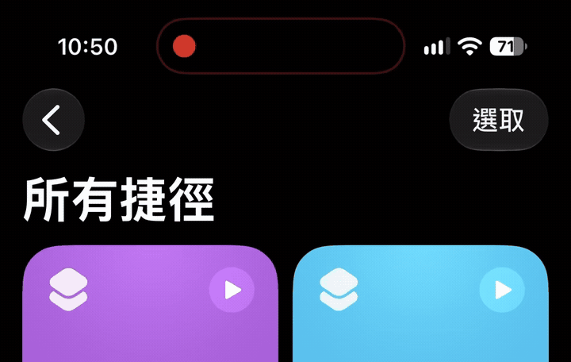

# NotificationIsland

<p align="center">
  
</p>

> Display custom notifications on the iPhone Dynamic Island from Shortcuts, while keeping a searchable history inside the app.

[繁體中文](./README.md) · [Download the latest IPA](https://github.com/panda-island/NotificationIsland/releases/latest) · [Add the Shortcut](https://www.icloud.com/shortcuts/c50df63435ea4f5f927447d1431173a1)

> [!IMPORTANT]
> NotificationIsland currently supports **iOS 27 or later**. Dynamic Island hardware is only required to display Dynamic Island notifications; notification-history-only mode works on devices without Dynamic Island.

## 📲 Installation

### 1. Download the IPA

Open [GitHub Releases](https://github.com/panda-island/NotificationIsland/releases/latest) and download the latest `NotificationIsland-unsigned.ipa`.

### 2. Sign and sideload with iLoader

The release contains an **unsigned IPA**, so it cannot be installed by simply tapping the file. The steps below use **iLoader**, a free and open-source sideloading companion for Windows, macOS, and Linux.

> [!WARNING]
> iLoader uses your Apple ID to request a development signature from Apple. Download it only from the [official iLoader website](https://iloader.app/) or its [official GitHub repository](https://github.com/nab138/iloader). Do not use builds from unknown websites. iLoader and NotificationIsland are independent projects and are not officially affiliated.

#### Prepare your computer

1. Download `NotificationIsland-unsigned.ipa` from [NotificationIsland Releases](https://github.com/panda-island/NotificationIsland/releases/latest) and remember where it was saved.
2. Download the latest build for your operating system from the [official iLoader download page](https://iloader.app/) or [iLoader GitHub Releases](https://github.com/nab138/iloader/releases/latest).
3. On Windows, follow [Apple's official instructions to install iTunes or Apple Devices](https://support.apple.com/en-us/118290) so the computer has the components required to communicate with the iPhone. macOS includes the required components.
4. Connect the unlocked iPhone with a USB data cable. If this is the first connection, tap **Trust** on the iPhone and enter the device passcode.

#### Install NotificationIsland

1. Open iLoader and make sure it detects your iPhone.
2. Select **Import IPA**.
3. Choose the downloaded `NotificationIsland-unsigned.ipa` file.
4. Sign in with your Apple ID when prompted and complete two-factor authentication if enabled.
5. Select an available development team/account, then start signing and installation. Keep the iPhone connected until iLoader reports completion.
6. Return to the iPhone Home Screen and confirm that NotificationIsland is present.

#### Before the first launch

If iOS reports an untrusted developer or asks you to enable Developer Mode:

1. Open **Settings → General → VPN & Device Management**, select the developer profile for your Apple ID, and tap **Trust**.
2. If requested, open **Settings → Privacy & Security → Developer Mode**, enable it, restart the iPhone, and confirm again when prompted.
3. Open NotificationIsland again.

> [!NOTE]
> Apps sideloaded with a free Apple Developer account usually need to be re-signed periodically and may be subject to installed-app and App ID limits. Apple controls the exact limits. If the app expires or stops opening, import the same IPA into iLoader and install it again. Installing over the existing app with the same Apple ID and bundle ID will usually preserve app data, but important records should still be backed up.

#### Troubleshooting

- **iLoader cannot find the iPhone:** Unlock it, reconnect USB, try a data-capable cable, and make sure you tapped **Trust**. On Windows, follow [Apple's instructions](https://support.apple.com/en-us/118290) to install or restart iTunes/Apple Devices and try again.
- **Signing or installation fails:** Read iLoader's complete error and suggested fix. Use **View Logs** for more detail, then search or report the problem in [iLoader Issues](https://github.com/nab138/iloader/issues).
- **App/App ID limit reached:** Remove sideloaded apps you no longer use, or wait for an existing App ID to expire.
- **The installed app immediately refuses to open:** Trust the developer profile and enable Developer Mode. If its signature has expired, sideload it again.

You may alternatively use [Sideloadly](https://sideloadly.io/) or another trusted signing tool that supports unsigned IPA files; its screens and steps will differ.

### 3. Add the Shortcut

After installing and opening the app:

1. Tap **Add Shortcut** inside NotificationIsland.
2. Add **Show Dynamic Island Message** from the iCloud Shortcut page.
3. Configure the title, message, and notification icon in the Shortcuts app.
4. Run the Shortcut to display the notification on Dynamic Island.

You can also open it directly: [Add the NotificationIsland Shortcut](https://www.icloud.com/shortcuts/c50df63435ea4f5f927447d1431173a1)

## 🎬 Preview

<p align="center">
  
</p>

<p align="center">
  
</p>

## ✨ App Features

- **Dynamic Island notifications:** Display a custom title, message, and app icon.
- **Automatic five-second dismissal:** The Live Activity is removed after approximately five seconds.
- **Immediate replacement:** A new notification removes the previous Dynamic Island and displays the latest content.
- **Display toggle:** Disable Dynamic Island while continuing to save notification history; this mode does not require a device with Dynamic Island.
- **Notification history:** Save titles, messages, icons, and timestamps; delete individual records or clear everything.
- **Automatic cleanup:** Disable automatic deletion or retain records for 1–365 days; the default is seven days.
- **Multiple notification icons:** LINE, Instagram, Gmail, Messages, Retro, Pikmin Bloom, Duolingo, Investment Master, Taishin Bank, StressWatch, Reddit, and Threads.
- **Tap to open:** Tapping a Live Activity attempts to open the app represented by its selected icon.

## 📱 Requirements

- iOS 27 or later
- An iPhone with Dynamic Island is required only for Dynamic Island notifications
- Notification-history-only mode works on devices without Dynamic Island
- An Apple ID and compatible signing tool when installing the unsigned IPA

## ⚠️ Limitations

NotificationIsland is an experimental project built with SwiftUI, ActivityKit, WidgetKit, App Intents, and Shortcuts. It is not an official notification tool from LINE, Instagram, Gmail, Apple, or any other third-party service.

The project cannot read private system notifications from other apps. Notification content must be supplied by the user through Shortcuts:

```text
Shortcuts → NotificationIsland → Live Activity → Dynamic Island
```

Whether tapping a Live Activity can open another app depends on that app's URL scheme, Universal Link support, and iOS restrictions.

## 🛠️ Building from Source

Open `NotificationIsland.xcodeproj` in Xcode to build the project. Windows users can also fork the repository and use the included GitHub Actions macOS runner to produce an unsigned IPA for signing and installation.

Core technologies: Swift, SwiftUI, ActivityKit, WidgetKit, App Intents, Shortcuts, and Live Activities.

## 💖 Sponsor

If you find this project useful, you are welcome to support development through cryptocurrency.

### Polygon (POL / ERC-20 Tokens)


- **Network:** Polygon (POS)
- **Address:** `0xFe8F7ae9526C9dE0CF4E793d4b313340c105E3Be`
